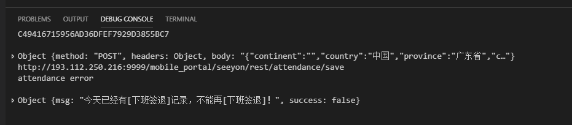

# auto-m3
seeyon m3 app auto attendance

## Usage

**修改的地方**

### module\config.default.js

将 `module\config.default.js` 重命名为 `module\config.js` 再按照里边配置修改说明进行修改

### Run

`node index` 或 `npm run start`

## Screenshot

 

## License

 

